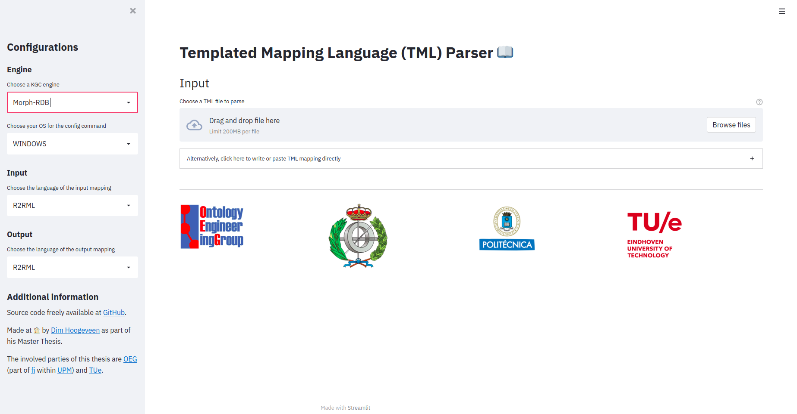
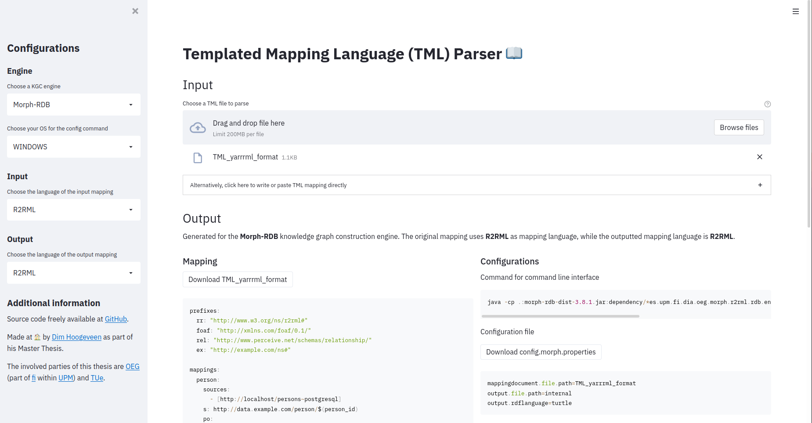

# Templated Mapping Language (TML) Parser :open_book:

> Made at :house: by [Dim Hoogeveen](https://www.linkedin.com/in/dimhoogeveen/?locale=en_US)  as part of his Master Thesis. 

> The involved parties of this thesis are [OEG](https://oeg.fi.upm.es/) 
> (part of [fi](http://fi.upm.es/) within [UPM](https://www.upm.es/))
> and [TUe](https://www.tue.nl/en/).

## Install and run locally

- Clone this repository
- In terminal, run the following command (assuming no conda environment) to install the necessary packages: `pip install -r requirements.txt`
- Change into core directory: `cd core` 
- To then start the instance locally, run the following command in terminal: `streamlit run main.py`

## Screenshots

